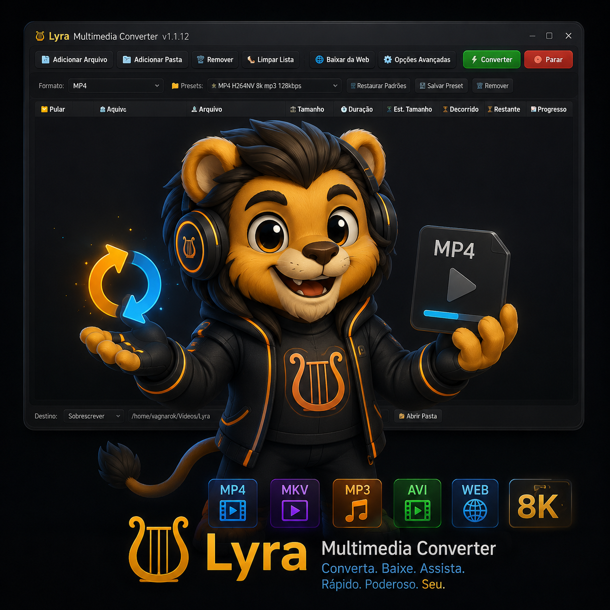

# 📖 Manual de Uso: Lyra Multimedia Converter

Bem-vindo ao **Lyra Multimedia Converter**! Este aplicativo foi desenhado para ser uma "fábrica" de mídias no seu computador. Com ele, você pode transformar vídeos enormes em arquivos leves para WhatsApp, isolar a música de um clipe, limpar chiados de gravações de voz, embutir legendas e marcas d'água, acelerar áudios e até baixar conteúdo da internet. Tudo isso com o poder das opções de estúdio acessíveis em poucos cliques.

Se você não tem intimidade com termos de edição de vídeo, não se preocupe: este manual foi feito para você.

---

## 1. O Básico: Convertendo seu Primeiro Vídeo ou Áudio

Na tela inicial, a opção **"Formato:"** é onde a mágica acontece. O Lyra pode converter tanto Vídeos quanto Áudios.

### Passo-a-Passo:
1. **Adicionar Arquivos:** Clique no botão grande `Adicionar Arquivo` ou `Adicionar Pasta` (você também pode simplesmente **arrastar seus arquivos** para dentro do aplicativo).
   * **Dica de Ouro:** O Lyra se integra ao seu sistema! Você pode selecionar vídeos direto nas suas pastas, clicar com o botão direito, ir em **"Abrir com..."** e escolher o Lyra para importá-los instantaneamente!
2. **Onde Salvar:** No campo de destino (na parte inferior), clique na pastinha para dizer ao Lyra onde os arquivos novos devem ser salvos.
3. **Ações ao Concluir:** Vai converter uma pasta gigantesca e quer ir dormir? Use a opção **"Ao Concluir"** no canto inferior direito para programar o Lyra para **Desligar** ou **Suspender** o computador automaticamente quando terminar!
4. **Formato de Saída:**
   * **Se quiser vídeo:** Escolha `MP4` ou `MKV` (os mais universais), ou `WEBM` (ótimo para web).
   * **Se quiser apenas o áudio:** Escolha `MP3` (música padrão), `OGG`, `WAV`, etc.
5. **Iniciar:** Clique em `🚀 Converter` no topo ao lado direito. A barra de progresso mostrará o tempo exato e a estimativa de tamanho!

---

## 2. A Aba de Downloads da Web

Viu um vídeo ou escutou uma música na internet (como no YouTube) e quer guardar no PC? O Lyra faz isso para você.

1. Clique em **"🌐 Baixar da Web"** na barra superior.
2. Cole o **Link/URL** do vídeo na barra de endereço.
3. Modo de extração: Escolha entre `Vídeo Completo` para baixar o vídeo e `Somente Áudio` para baixar apenas o áudio.
4. Resolução Máxima: Escolha entre resoluções `480p`, `720p`, `1080p`, `1440p` ou `2160p` (4K). Recomenda-se usar `720p` ou `1080p` para obter um bom equilíbrio entre qualidade e tamanho de arquivo.
5. Clique no ícone de Download azul e espere! O Lyra fará tudo sozinho e já deixará o arquivo pronto.

---

## 3. O Poder Oculto: Menu de Opções Avançadas

Clicando no botão **"⚙️ Opções Avançadas"** no topo, você acessa a "Nave Espacial" do Lyra. Toda a interface aqui é dividida em **Abas Verticais (Menu Lateral)**, agrupadas por categorias.

### 🎧 Ferramentas de Áudio
Se o áudio do seu vídeo está estourando, abafado ou cheio de chiado de vento:
* **Leveler / DRC (Normalizador de Volume):** Equaliza o áudio. Levanta o volume das vozes suaves e abaixa o estouro das explosões.
* **Remoção de Ruído com IA (RNNN):** Isola a voz humana, apagando o chiado do vento e os ruídos de fundo.

### 🎥 Aba de Vídeo (Estilo Handbrake)
Se você quer controle absoluto sobre a imagem, o painel de Vídeo oferece recursos profissionais de estúdio (Encoder Settings):
* **Qualidade Inteligente (CRF):** Um slider que controla a qualidade visual. `23` é o normal, números menores = qualidade insana (mas arquivo gigante), números maiores = menor tamanho (mas imagem mais borrada).
* **2-Pass (Duas Passadas) e Turbo Pass:** Se desmarcar a Qualidade CRF, você pode limitar o tamanho definindo o "Bitrate". O **2-Pass** garante a melhor qualidade possível dentro desse limite e o **Turbo Pass** acelera dramaticamente a primeira passada de análise!
* **Otimização de Codificador:** Você pode trocar o *Preset* (de `ultrafast` para `placebo`), mudar o *Tune* (como `film` para filmes reais ou `animation` para animes), definir *Profiles/Levels* e escolher *CFR/VFR* dependendo se a taxa de quadros for travada ou dinâmica.

### ⏱️ Aba de Velocidade
Quer o vídeo mais rápido ou mais devagar? 
* Aqui você escolhe a aceleração de **0.1x até 10.0x**.
* **Preservar Tom do Áudio:** Deixe essa caixa marcada para evitar a "Voz de Esquilo" (pitch distorcido). O Lyra fará o processamento pesado e as vozes continuarão normais mesmo 2x mais rápido!

### 🖼️ Aba de Marcadores (Capas e Metadados)
Ideal para músicos e podcasts:
* Preencha dados como **Título, Artista, Álbum e Ano**. O título servirá como nome final do arquivo!
* **Injeção de Capa (Cover Art):** Selecione uma imagem (JPG/PNG) e ela ficará embutida magicamente dentro do seu MP3, FLAC ou OGG, aparecendo no rádio do carro ou no reprodutor do celular!

### 💬 Aba de Legendas e ✨ Filtros
* Adicione legendas `.srt` soltas aos seus vídeos ou extraia as legendas existentes!
* Insira uma **Marca D'água** (logotipo) por cima dos seus vídeos! Você define a posição (canto, centro), o tamanho e até a opacidade, perfeito para proteger seus vídeos antes de postar na internet.

### ✂️ Aba de Cortes (Trimming)
Quer apenas os 10 segundos mais engraçados de um clipe?
1. Acesse a aba **Cortes**. O player de vídeo abrirá na tela.
2. Arraste a linha do tempo e use os botões **`⏱️ Marcar Início`** e **`⏱️ Marcar Fim`**.
3. Volte para a aba principal e converta. O Lyra excluirá o resto do vídeo em tempo recorde!

---

## 4. O Segredo da Velocidade (Acelerando com a Placa de Vídeo)

Se você tem uma Placa de Vídeo (GPU) da **NVIDIA**, você tem um superpoder.
* Vá nas **Opções Avançadas -> Aba de Vídeo** e mude o Codec de Vídeo para **`h264_nvenc`** ou **`hevc_nvenc`**.
* O Lyra repassará a tarefa de renderização 100% para a sua Placa de Vídeo! O vídeo converte muito mais rápido, sem travar o processador principal do seu computador.

---

## 5. Resolução de Problemas (FAQ)

**1. A opção "Codificação com várias passagens" ou "Turbo" estão cinzas/bloqueadas!**
O FFmpeg só permite essas opções em cenários específicos. Vá na aba de Vídeo, **desmarque a "Qualidade Inteligente (CRF)"** e certifique-se de que o codec `libx264` ou `libx265` está selecionado.

**2. O download do YouTube travou ou deu "Erro na extração"!**
O YouTube altera seu sistema frequentemente para bloquear aplicativos. **Apenas feche o Lyra e tente novamente mais tarde, ou rode o script de atualização do pacote**. Nossa base (yt-dlp) atualiza constantemente para contornar bloqueios.

**3. Marquei NVENC e recebi uma mensagem de erro ao iniciar!**
Isso acontece se o seu computador usar placas da Intel/AMD ou for incompatível. O NVENC é exclusivo para placas da NVIDIA. Volte o Codec para `libx264` e a conversão prosseguirá normalmente na CPU.

**4. Atualizei o driver de vídeo no Linux e o Lyra parou de converter!**
Se você estiver usando a versão **Flatpak**, o ambiente isolado do aplicativo ainda está conectado à cópia da versão antiga do seu driver de vídeo. Para resolver, basta abrir o terminal e digitar `flatpak update`.

---

🎉 *Pronto! Você já domina 100% da fábrica de mídias do Lyra Multimedia Converter.*
